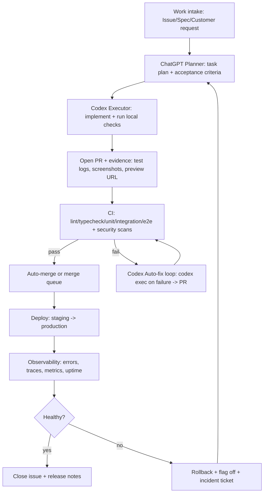

# Building an Efficient ChatGPT‑Planner + Codex‑Executor Software Delivery Pipeline

## Executive summary

A high‑leverage “ChatGPT as planner / Codex as hands” buildout is easiest to sustain when you separate **decisioning** (what to build, acceptance criteria, risk) from **execution** (edits, tests, deploys) and then automate the execution path so it is repeatable, auditable, and gated by quality checks rather than human busywork. OpenAI Codex already supports the key primitives you need to do this safely at scale: **project guidance via AGENTS.md**, **scripting via `codex exec`**, **CI/CD execution via the Codex GitHub Action**, and **guardrails via sandboxing + approvals + rules + hooks**. citeturn16search19turn17view1turn17view0turn14view2turn16search3turn16search2

A pragmatic baseline that minimizes human touchpoints while preserving quality looks like this:

- **System of record:** GitHub repo + PR workflow (branch protection, CODEOWNERS, merge queue for busy repos), plus GitHub Issues or Linear for structured work intake. citeturn13search1turn13search0turn13search2turn4search0turn4search2  
- **Execution engine:** Codex runs in automation using **`codex exec` (non‑interactive)** and/or **`openai/codex-action@v1`** in GitHub Actions, with a narrow permission set and no production secrets on PR workflows. citeturn17view1turn17view0turn2search3  
- **Deploy targets:** choose one “default deploy path” and standardize it (Vercel/Netlify for web frontends; Render for app services). All three support rapid rollback patterns. citeturn1search0turn12search3turn1search2turn12search2  
- **Quality gates:** lint/typecheck/unit/integration/e2e (Playwright or Cypress), plus supply‑chain scanning (Dependabot), secret scanning push protection, and CodeQL code scanning. citeturn11search0turn11search1turn3search37turn3search2turn3search3  
- **Release safety:** progressive delivery (feature flags + canary/rolling releases) and one‑click/instant rollbacks, with deployment approvals only when risk warrants it (e.g., production). citeturn12search22turn12search2turn8search2turn8search3turn6search35  
- **Observability:** OpenTelemetry as the standard, exporting to a vendor (Datadog) or an error‑first tool (Sentry), plus product analytics (PostHog or GA4) and uptime monitoring. citeturn6search0turn6search2turn6search1turn6search3turn9search0  

The minimal human touchpoints in this model are intentionally few: **(a)** approve “high‑risk” PRs when required by policy (CODEOWNERS/rulesets), **(b)** approve production deployments when protected environments require it, and **(c)** respond to true incidents (alerts) rather than babysitting routine builds. citeturn13search0turn13search3turn2search14turn13search7  

### Prioritized checklist

| Priority | What to implement | Why it matters for “minimal human, high quality” |
|---|---|---|
| Must‑have | AGENTS.md + repo scripts (`make`/`task` commands) | Codex reads AGENTS.md before work and can be forced into repeatable verification routines. citeturn16search19turn14view0 |
| Must‑have | GitHub Actions CI (lint/test/build/e2e) + branch protection + required checks | Prevents “agent shipped broken code” by making merges conditional on passing checks. citeturn13search1turn11search0 |
| Must‑have | Secrets discipline (env secrets, least privilege, push protection) | Most real-world automation failures become security failures. GitHub explicitly warns about secret exposure risks and least privilege. citeturn2search3turn3search37turn3search33 |
| Must‑have | Preview deploys per PR (Vercel/Netlify) | Converts review from “read code” to “click and validate behavior.” citeturn1search0turn1search1 |
| Must‑have | Rollback mechanism (Instant rollback / publish previous deploy / Render rollback) | Keeps “ship” safe even when automation is aggressive. citeturn12search2turn12search3turn1search2 |
| Nice‑to‑have | Codex auto‑fix workflow for CI failures | Codex can auto‑propose fixes when CI fails, opening PRs; you review/merge rather than debug from scratch. citeturn17view1turn17view2 |
| Nice‑to‑have | DB branching for preview deploys (Neon) | Eliminates the “preview deploy but wrong DB/state” problem. citeturn7search3turn7search23 |
| Nice‑to‑have | Merge queue for high‑throughput repos | Stops “green PRs break main when merged together.” citeturn13search2turn13search6 |
| Optional | Dedicated orchestrator with Agents SDK + Codex MCP server | Enables a true multi‑agent pipeline (planner agent → codex agent) beyond GitHub Actions. citeturn2search4turn2search0 |
| Optional | Central secrets manager (Vault / cloud secret managers) + OIDC federation | Removes long‑lived CI credentials; prefer OIDC flows. citeturn5search0turn5search4turn2search3 |

## Reference architecture and automated workflow

The most reliable operating model is a **loop** where ChatGPT produces structured work plans, Codex produces diffs + proof (tests, logs), CI independently verifies, and deployment + monitoring feed back into the next plan.



Key enabling features in Codex for this loop:

- **AGENTS.md as durable “working agreement.”** Codex reads AGENTS.md files before doing any work and supports layered overrides (global `~/.codex/AGENTS.md`, repo root AGENTS.md, subdirectory overrides). citeturn16search19turn14view0  
- **Non‑interactive scripting with `codex exec`.** Designed explicitly for CI and pipelines; streams progress to stderr and emits the final message to stdout for piping into other tools. citeturn17view1  
- **Codex GitHub Action (`openai/codex-action@v1`).** Installs the CLI and runs `codex exec` inside GitHub Actions with the permissions you specify. citeturn17view0  
- **Safety controls (sandbox + approvals).** `codex exec` is read‑only by default; you can explicitly enable edits with `--full-auto` and should reserve broad access (`danger-full-access`) for isolated environments only. citeturn17view1turn14view2  

## Integration stack with provider tradeoffs and exact patterns

This section gives a **catalog** you can implement as a prioritized “connect these services” plan. Wherever possible, the integration patterns use established primitives: **GitHub Actions + OAuth/API keys + webhooks**.

### Provider tradeoff tables

#### Repo hosting and CI/CD

| Option | Strengths for agentic automation | Weaknesses / watch‑outs |
|---|---|---|
| GitHub + GitHub Actions | Tight integration with PRs, environments, protection rules, CODEOWNERS, merge queue; robust webhook/event model; common ecosystem for automation. citeturn13search1turn13search0turn13search2turn4search1turn2search33 | Secrets risk model: GitHub notes users with write access can read repository secrets; must harden permissions and use environments. citeturn2search3turn2search14 |
| GitLab + GitLab CI | Strong built‑in CI, variables, container registry; “one platform” appeal; CI/CD variables are first‑class. citeturn1search3turn10search6 | Requires equivalent governance setup; variable masking is not a complete defense against a determined insider. citeturn1search27turn1search3 |

#### Hosting and deploy surface

| Option | Best for | Built‑in rollback / release safety |
|---|---|---|
| Vercel | Frontend + Next.js‑style apps; preview deployments per push/PR; Git integrations. citeturn1search0turn12search26 | Instant Rollback and Rolling Releases (canary/gradual rollout). citeturn12search2turn12search22 |
| Netlify | Static/JAMstack + serverless/edge functions; deploy previews; easy rollbacks. citeturn1search1turn12search11 | Roll back by publishing a previous deploy. citeturn12search3turn12search7 |
| Render | Full‑stack services (web services, background workers) with Git‑based deploys; API‑triggered deploys. citeturn1search2turn18search2 | Roll back to a previous deploy quickly; reuses build artifacts for speed. citeturn1search2 |

#### Feature flags

| Option | Strengths | Notes on tokens/permissions |
|---|---|---|
| PostHog | “All‑in‑one” analytics + feature flags + experiments; developer‑centric. citeturn6search3turn6search35 | Uses project tokens/keys; treat as production secrets. citeturn6search11 |
| LaunchDarkly | Mature enterprise feature management; strong governance; explicit least‑privilege guidance for API tokens. citeturn8search2turn8search14 | Prefer scoped tokens/custom roles; don’t use admin tokens from CI unless strictly required. citeturn8search2 |
| Unleash | Open source + enterprise options; client/server APIs with environment/project scoping. citeturn8search3turn8search7 | Backend tokens can be scoped to projects/environments; use proxy pattern for client-side needs. citeturn8search3turn8search27 |

### Integration catalog with permissions and one‑sentence implementation steps

The table below is organized to match your request: **purpose**, **recommended provider(s)**, **integration method**, **required permissions/scopes**, plus **one‑sentence steps**.

#### Must‑have integrations

| Capability | Purpose | Recommended provider(s) | Integration method | Required permissions/scopes (minimum viable) | One‑sentence implementation steps |
|---|---|---|---|---|---|
| Repo hosting + PR governance | Single source of truth for code, reviews, and automation triggers | GitHub | Native PRs + branch protection + CODEOWNERS | Branch protection requiring reviews and status checks; CODEOWNERS file; optionally merge queue. citeturn13search1turn13search0turn13search2 | Add CODEOWNERS, then protect `main` with required checks and approvals; enable merge queue once CI supports merge_group triggers. citeturn13search2 |
| CI | Deterministic verification of every PR and merge | GitHub Actions | Workflows on `pull_request`, `push`, `merge_group` | Minimal `GITHUB_TOKEN` permissions per job; restrict write permissions unless needed. citeturn3search0turn2search3turn13search2 | Implement `ci.yml` that runs lint/tests/build/e2e and mark jobs as required status checks in branch protection. citeturn13search1turn11search0 |
| Codex execution in CI | Let Codex implement, review, or auto-fix in a controlled path | OpenAI Codex | `openai/codex-action@v1` or raw `codex exec` | GitHub Actions job permissions like `contents: read` and only add `pull-requests: write` when posting reviews; store `OPENAI_API_KEY` as a secret. citeturn17view0turn17view2 | Add a workflow that runs Codex in non‑interactive mode for code review and optionally a separate workflow_run job to open auto‑fix PRs. citeturn17view1turn17view2 |
| Issue tracker | Structured, machine‑parsable work intake | GitHub Issues or Linear | GitHub REST API / Linear OAuth | GitHub Issues REST API access; Linear OAuth 2.0 (scoped) when used. citeturn4search0turn4search2 | Use issue templates to enforce acceptance criteria fields; optionally sync tasks via API (GitHub Issues REST, Linear OAuth). citeturn4search0turn4search2 |
| Secrets handling | Keep keys out of code and control access | GitHub Environments + Secrets | Environment secrets + protection rules | Jobs referencing an environment must pass protection rules before accessing environment secrets. citeturn2search14turn2search2 | Put production secrets in a protected environment; require reviewers and prevent self-approval for production deploy jobs. citeturn13search3turn13search7 |
| Secret leak prevention | Prevent hardcoded credentials from landing in repo history | GitHub Secret Scanning + Push Protection | Native GitHub security feature | Enable secret scanning/push protection; understand alert types and push blocking behavior. citeturn3search33turn3search37turn3search1 | Turn on push protection so pushes containing secrets are blocked before they land. citeturn3search37 |
| SAST / code scanning | Catch classes of vulnerabilities automatically | GitHub CodeQL | GitHub Actions `codeql-action` | Enable CodeQL code scanning in repo settings/workflows. citeturn3search3turn3search7 | Enable CodeQL default/advanced setup and make it a required status check for merges. citeturn3search3turn13search1 |
| Dependency hygiene | Keep dependencies updated via PRs | Dependabot | `.github/dependabot.yml` + GitHub automation | Dependabot version updates enabled; workflow review required. citeturn3search2turn3search10 | Configure Dependabot for your ecosystems (app deps + GitHub Actions) and auto‑merge low‑risk patch updates behind CI. citeturn3search2 |
| Hosting + preview deploys | “Click to validate” environments per PR | Vercel or Netlify | Git integration or CLI in CI | Vercel Git integration provides preview deploys on every push; Netlify Deploy Previews for PRs. citeturn1search0turn1search1 | Connect the repo; require preview URLs in PR template; treat preview as the acceptance environment. citeturn1search0turn1search1 |
| Rollback | Rapid recovery without heroics | Vercel / Netlify / Render | Platform rollback mechanism | Vercel Instant Rollback; Netlify publish previous deploy; Render rollback to last deploy. citeturn12search2turn12search3turn1search2 | Document “rollback in 60 seconds” steps and ensure deploy tooling retains deploy history/build artifacts. citeturn1search2turn12search3 |
| Observability standard | Vendor‑neutral telemetry foundation | OpenTelemetry | SDK instrumentation + OTLP export | OTel emits traces/metrics/logs and exports to backends. citeturn6search0turn6search2 | Instrument services with OTel and export OTLP to your chosen backend (or collector) from all environments. citeturn6search0 |
| Error tracking | Fast detection of regressions | Sentry | SDK + release/deploy integration | Sentry release health and deploy association for visibility. citeturn6search1turn6search13 | Integrate Sentry SDK and wire CI to create releases so every deploy has traceability. citeturn6search1 |
| Product analytics | Measure outcomes, not just uptime | PostHog or GA4 | SDK + server events | GA4 Measurement Protocol supports server‑side events; PostHog provides analytics + flags. citeturn9search0turn6search3 | Add analytics SDK and standardize event schemas; optionally send server events via GA4 Measurement Protocol. citeturn9search0turn9search24 |
| End‑to‑end tests | Acceptance-level verification | Playwright or Cypress | Run in CI via GitHub Actions | Playwright can generate a GitHub Actions workflow; Cypress provides GitHub Actions CI guidance. citeturn11search0turn11search1 | Add E2E tests and require them on PRs touching UI/API; upload HTML reports/traces as artifacts. citeturn11search0 |

#### Nice‑to‑have integrations

| Capability | Purpose | Recommended provider(s) | Integration method | Required permissions/scopes | One‑sentence implementation steps |
|---|---|---|---|---|---|
| Cloud auth without static keys | Remove long‑lived cloud creds from CI | GitHub OIDC + cloud IAM / Vault | OIDC federation | GitHub Actions secure use recommends least privilege; Vault OIDC/JWT auth; examples exist for Vault via GitHub OIDC. citeturn2search3turn5search0turn5search4 | Use GitHub Actions OIDC to obtain short‑lived credentials from your cloud or Vault instead of storing static secrets. citeturn5search0 |
| Central secrets manager | Rotation + audit + fine-grained secret access | Vault / AWS Secrets Manager / GCP Secret Manager / Azure Key Vault | SDK/API retrieval at runtime + CI retrieval | AWS Secrets Manager rotation; GCP Secret Manager least privilege; Azure Key Vault RBAC guidance. citeturn5search33turn5search2turn5search35 | Centralize secrets and enforce least‑privilege access at the secret (not project) level; rotate credentials. citeturn5search2turn5search1 |
| DB branching for previews | Production-like preview environments | Neon (Postgres) | Vercel integration or API branch creation | Neon branching creates DB branches with parent data; Vercel marketplace integration can create a DB branch per preview deploy. citeturn7search3turn7search23 | Turn on Neon branching per preview deployment so each PR has isolated schema/data. citeturn7search23 |
| CRM | Close the loop from product to revenue | HubSpot | OAuth app / private app + webhooks | HubSpot scopes are endpoint-driven; required scopes are documented per endpoint. citeturn7search0 | Implement OAuth with only required scopes for the CRM objects you touch (contacts, deals, etc.). citeturn7search0 |
| Form provider | Lead capture and inbound workflows | Typeform | API token or OAuth + webhooks | Typeform APIs use personal access tokens in Authorization header; OAuth also possible. citeturn7search1turn7search5 | Create a form, add a webhook receiver in your app, and authenticate calls with a PAT/OAuth depending on tenancy. citeturn7search1 |
| Container registry | Standard artifact for deploy | GHCR / GitLab registry / Docker Hub | Docker login in CI | GitHub Container Registry docs describe PAT usage; GitLab registry tokens have `read_registry`/`write_registry`. citeturn10search0turn10search6 | Build/push images from CI with a registry-scoped token and keep deployment pinned to immutable tags/digests. citeturn10search6 |

## Security and least‑privilege design for agentic buildouts

When you push toward “minimal human actions,” you must compensate with **stronger guardrails**. The safest designs assume the automation will eventually misbehave and ensure it cannot do catastrophic damage.

### Codex safety controls you should treat as non‑negotiable

Codex provides layered controls that map well to least privilege:

- **Sandbox modes + approval policies** let you bound what commands can do. `--full-auto` is explicitly described as a lower‑risk preset (workspace-write + on-request), while full bypass (`--yolo`) is “dangerous.” citeturn14view2turn2search21  
- **Network access is off by default** in workspace-write and must be explicitly enabled in config (`[sandbox_workspace_write] network_access = true`), which helps reduce unintended data exfiltration and prompt injection exposure. citeturn14view1  
- **Rules** evaluate commands and choose “most restrictive wins,” splitting chained commands to prevent smuggling dangerous operations alongside allowed ones. citeturn16search3  
- **Hooks** can inject your own validators (e.g., scan prompts for secrets, block certain patterns, enforce output formatting). citeturn16search2  

In practical terms: keep Codex in **read-only** for advisory CI jobs (review, summarization), and only allow write operations in narrowly scoped contexts (e.g., an auto-fix branch that can only open PRs, not deploy). `codex exec` defaults to read‑only specifically to support this pattern. citeturn17view1  

### GitHub Actions hardening essentials for an “AI ships code” world

GitHub’s own guidance emphasizes that secrets handling and least privilege are central risks in Actions:

- GitHub notes that **any user with write access can read repository secrets**, and recommends least privilege when using credentials in workflows. citeturn2search3  
- **Environment secrets + deployment protection rules** ensure a job must satisfy environment protection rules before it can access that environment’s secrets. This is the cleanest way to protect production credentials in an automated pipeline. citeturn2search14turn2search2  
- GitHub environments support **required reviewers** and an option to **prevent self‑reviews** for deployments to protected environments. citeturn13search3turn13search7  
- **Secret scanning + push protection** is explicitly designed to stop secrets before they reach your repo. citeturn3search37turn3search33  

### Safer cloud/API access patterns for deploy automation

If you must deploy from CI to cloud services, avoid static credentials where possible:

- Prefer **OIDC federation** patterns (GitHub Actions → cloud/Vault) so CI uses short‑lived credentials rather than long‑lived keys stored as secrets. GitHub provides specific guidance for Vault OIDC token exchange and secret retrieval flows. citeturn5search0turn5search4turn2search3  
- If you do use cloud secret managers, adopt their least‑privilege models: GCP Secret Manager explicitly recommends granting access at the lowest level (individual secret) and separating “read secret value” from “manage secrets.” citeturn5search2turn5search10  
- If you use Azure Key Vault, Microsoft explicitly warns that RBAC is preferred for improved security and separation of duties. citeturn5search35turn5search3  

## Automated testing and acceptance checks Codex must run

Codex becomes dramatically more reliable when the repository defines “done” as **commands that pass**, not prose. Codex’s own best‑practice framing encourages treating it like a teammate you configure and validate over time. citeturn16search23  

### What “Codex must run” should mean in practice

Define a small set of **canonical scripts** and require them conditionally:

- `make lint` / `npm run lint`  
- `make typecheck` / `npm run typecheck`  
- `make test` / `npm test` (unit + integration)  
- `make e2e` (Playwright/Cypress)  
- `make build`  
- `make smoke` (hit health endpoints against preview/staging)  

Then encode the conditional rules in AGENTS.md (for Codex behavior) and enforce them in CI (for merges). Codex is explicitly designed to read AGENTS.md before work, and AGENTS.md layering supports service-specific rules deeper in the tree. citeturn16search19turn14view0  

### Recommended test runner defaults

For UI workflows:

- **Playwright**: its docs note that Playwright setup can generate a GitHub Actions workflow file so tests run on pushes and PRs, and it supports HTML reports/traces for debugging. citeturn11search0turn11search20  
- **Cypress**: Cypress documents GitHub Actions setup including caching and parallelization. citeturn11search1turn11search5  

For backend workflows:

- Ensure your test runner’s exit codes are interpreted correctly; for example, pytest documents distinct exit codes (including “no tests collected”), which matters for automation logic and “false green” prevention. citeturn11search2turn11search14  

### Automated acceptance checks beyond tests

To preserve quality under heavy automation, add a small set of “acceptance gates” that are cheap but powerful:

- **Preview deploy validation:** PR must include a preview URL (Vercel/Netlify) and any required environment notes. citeturn1search0turn1search1  
- **Security gates:** secret scanning push protection, Dependabot, CodeQL. citeturn3search37turn3search2turn3search3  
- **Codex code review (advisory or blocking):** Codex can review PRs directly in GitHub using `@codex review`, and it can be automated to review every PR; guidance can be refined via AGENTS.md “Review guidelines.” citeturn16search4  

## Deployment and rollback strategies that work with minimal human intervention

A “hands‑off shipping” system needs two properties: **controlled rollout** and **fast rollback**.

### Deployment patterns per hosting provider

- **Vercel**:  
  - Git integration provides preview deployments for every push and production deployments from the production branch. citeturn1search0turn12search26  
  - Use **Rolling Releases** when you want canary behavior and measured rollout; Vercel explicitly notes you can revert via Instant Rollback during a rollout. citeturn12search22turn12search2  
  - Use **Instant Rollback** for rapid recovery to a previous production deployment. citeturn12search2  

- **Netlify**:  
  - Deploy Previews support PR QA flows. citeturn1search1  
  - Rollback is achieved by publishing a previous deploy from deploy history. citeturn12search3turn12search7  

- **Render**:  
  - Rollbacks allow reverting to a previous deploy, reusing artifacts for speed. citeturn1search2  
  - You can trigger deploys via API (“Trigger deploy”) when you want CI‑driven release control or commit‑specific deploys. citeturn18search2turn18search32  

### Rollback for container/Kubernetes or “custom infra” paths

If you run Kubernetes or similar, Kubernetes Deployments support rolling updates and rollback to earlier revisions. citeturn12search1  

If you run AWS CodeDeploy‑based flows, AWS documents that rollbacks happen by redeploying a previously deployed revision (as a new deployment), either automatically or manually. citeturn12search0  

### Using feature flags as “safety valves”

Feature flags reduce the need for rollbacks by letting you disable behavior without reverting the entire deployment:

- LaunchDarkly recommends least‑privilege tokens for API use and supports structured rollout via its platform. citeturn8search2  
- Unleash documents separate client APIs and backend tokens that can be scoped by project/environment. citeturn8search3  
- PostHog includes feature flags as part of its broader product platform. citeturn6search35turn6search3  

Operationally: treat every major feature as **flagged** until it has survived real traffic, and require Codex to create a flag + default‑off path for risky changes.

## Repo conventions that make ChatGPT + Codex efficient

### Repo layout conventions

A lightweight structure that scales well with agents:

- `AGENTS.md` at repo root (global expectations + acceptance definition)  
- `docs/` for specs, runbooks, decision records  
- `docs/tasks/` for machine‑readable task briefs (what ChatGPT writes; what Codex executes)  
- `.github/workflows/` for CI/CD  
- `.codex/` for project‑scoped Codex config overrides (only loaded when trusted) citeturn16search12turn16search8  

Codex explicitly supports layered project overrides for AGENTS.md, and also supports project‑scoped config layers in `.codex/config.toml`. citeturn14view0turn16search12turn15view1  

### Sample AGENTS.md snippet that enforces the workflow

```md
# AGENTS.md

## Mission
Ship small, verifiable changes fast. Prefer boring solutions. Optimize for repeatability.

## Definition of Done (DoD)
A change is "done" only when:
- All required CI checks pass (lint, typecheck, unit/integration tests, build).
- If UI/API behavior changed: E2E tests are added/updated and pass.
- PR includes evidence: links to preview deploy + key screenshots/log snippets as needed.

## Required commands
- Lint:      `make lint`
- Typecheck: `make typecheck`
- Tests:     `make test`
- Build:     `make build`
- E2E (when applicable): `make e2e`

## Safety & secrets
- Never print or log secrets.
- Never add new third-party prod dependencies without explicit justification in the PR description.
- Do not request production secrets in PR workflows; production deploy jobs use protected environments.

## Pull request rules
- Keep PRs under ~300 LOC unless refactoring is the goal.
- Use staged commits with clear messages.
- Include an "Acceptance" section in the PR body mapping changes to tests or manual checks.

## Codex-specific guidance
- Always follow this order: plan → implement → run required commands → open PR with evidence.
- Use repo scripts; do not invent new commands unless you add them to the Makefile and document them.
- When uncertain, stop and ask for clarification—do not guess requirements.
```

Why this works: Codex reads AGENTS.md before doing work, and you can layer more specific rules deeper in the tree (e.g., `services/payments/AGENTS.override.md`). citeturn16search19turn14view0  

### Sample CI/CD pipeline YAML

This is intentionally concise and designed to: (1) run on PRs, pushes, and merge queue events, (2) run tests deterministically, (3) keep permissions minimal, and (4) provide a clear place to add deploy gates.

```yaml
name: CI

on:
  pull_request:
  push:
    branches: [main]
  merge_group: {} # for GitHub merge queue-required checks

permissions:
  contents: read

jobs:
  test:
    runs-on: ubuntu-latest
    timeout-minutes: 20
    steps:
      - uses: actions/checkout@v5

      - name: Setup Node
        uses: actions/setup-node@v4
        with:
          node-version: "20"

      - name: Install
        run: npm ci

      - name: Lint
        run: npm run lint --if-present

      - name: Typecheck
        run: npm run typecheck --if-present

      - name: Unit + integration tests
        run: npm test --if-present

      - name: Build
        run: npm run build --if-present

  e2e:
    # Only run e2e when repo supports it (adjust the condition to your stack)
    if: ${{ github.event_name != 'push' || github.ref == 'refs/heads/main' }}
    runs-on: ubuntu-latest
    timeout-minutes: 30
    steps:
      - uses: actions/checkout@v5
      - uses: actions/setup-node@v4
        with:
          node-version: "20"
      - run: npm ci
      - name: Run Playwright
        run: npx playwright test
```

Notes grounded in official docs:
- GitHub merge queue requires CI to trigger on `merge_group` events. citeturn13search2  
- Playwright documents CI setup and notes its installer can generate a GitHub Actions workflow file. citeturn11search0  

### Codex “auto-fix CI failure” workflow pattern

If you want Codex to reduce manual debugging time, the OpenAI cookbook describes a **`workflow_run` pattern**: when CI fails, check out the failing SHA, run `codex exec` with a narrow prompt, re-run failing commands, and open a PR with the fix. citeturn17view2turn17view1  

## Failure modes and mitigation strategies

High‑automation pipelines fail in predictable ways; you can engineer them out up front.

| Failure mode | Why it happens in agentic workflows | Mitigation that fits this architecture |
|---|---|---|
| “Agent shipped something unreviewable” | Large diffs, unclear intent, no proof | Enforce small PRs + required commands in AGENTS.md; require preview URL + CI checks. citeturn16search19turn13search1turn1search0 |
| Secrets leaked into logs/code | Agents paste tokens; CI echoes env vars | Enable push protection; use hooks to scan prompts; keep prod secrets behind protected environments. citeturn3search37turn16search2turn2search14 |
| “Green” PR breaks main | Interactions between PRs | Use merge queue so checks run on merge-group state; require those checks. citeturn13search2turn13search6 |
| Over‑privileged CI token causes damage | Workflow compromise escalates | Explicitly scope `GITHUB_TOKEN` permissions; follow secure use guidance and least privilege. citeturn3search0turn2search3turn3search12 |
| Flaky E2E blocks shipping | UI tests are inherently flaky | Keep e2e scope targeted; upload traces/reports; quarantine tests, don’t delete signal. citeturn11search0 |
| Rollout causes production regression | Real traffic differs from staging | Progressive rollout (rolling releases/canary) + fast rollback; feature flags as kill-switches. citeturn12search22turn12search2turn8search3turn8search2 |
| Tool misuse / dangerous commands | Over‑autonomy without constraints | Use Codex sandboxing + rules; keep network off unless needed; never use bypass modes outside hardened sandboxes. citeturn14view2turn14view1turn16search3turn2search21 |

## Official documentation quicklinks

```text
OpenAI Codex
- AGENTS.md guidance: https://developers.openai.com/codex/guides/agents-md
- Non-interactive mode (codex exec): https://developers.openai.com/codex/noninteractive
- Codex GitHub Action: https://developers.openai.com/codex/github-action
- Sandboxing & approvals: https://developers.openai.com/codex/agent-approvals-security
- Rules (execpolicy): https://developers.openai.com/codex/rules
- Hooks: https://developers.openai.com/codex/hooks
- MCP: https://developers.openai.com/codex/mcp

GitHub
- Secure use (Actions security): https://docs.github.com/en/actions/reference/security/secure-use
- Deployments/environments: https://docs.github.com/en/actions/reference/workflows-and-actions/deployments-and-environments
- CODEOWNERS: https://docs.github.com/en/repositories/managing-your-repositorys-settings-and-features/customizing-your-repository/about-code-owners

Hosting/Deploy
- Vercel Git deployments: https://vercel.com/docs/git
- Vercel Instant Rollback: https://vercel.com/docs/instant-rollback
- Netlify Deploy Previews: https://docs.netlify.com/deploy/deploy-types/deploy-previews/
- Render Rollbacks: https://render.com/docs/rollbacks
```

